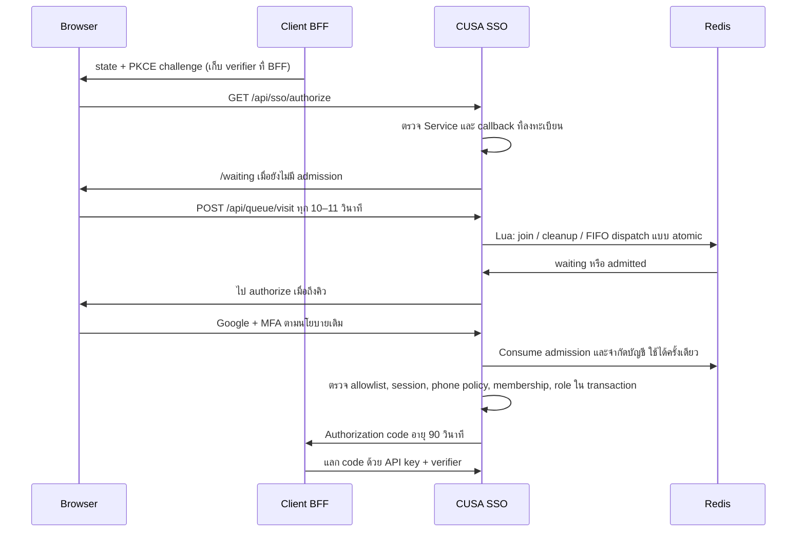

# ห้องรอคิวและการควบคุม Session

รุ่น 4 ตุลาคม 2026 สำหรับ HostAtom/Plesk เดิม ไม่ต้องมี root และไม่ต้องติดตั้ง PM2 ซ้อน Passenger ระบบคิวควบคุมการเริ่มยืนยันตัวตนของ Service ที่เปิดใช้เท่านั้น ไม่ใช่คิวซื้อสินค้าและไม่ป้องกัน DDoS ที่ทำให้ bandwidth เต็ม

## เปิดใช้

1. อัปโหลด/build รุ่นนี้ แล้วใช้บัญชี migration รัน `npm run db:migrate:production` ก่อน Restart App ต้องมี `007_waiting_room.sql` แม้ยังไม่เปิดคิว Migration เพิ่ม 4 columns ใน `applications`; ค่าเริ่มต้นปิดทุก Service ไม่มีตารางใหม่หรือ grants ใหม่ถ้าบัญชี runtime มีสิทธิ์บนตารางนี้ครบตาม template อยู่แล้ว
2. เปลี่ยนกลับบัญชี runtime ตั้ง `REDIS_URL` เป็น Redis TCP URL เช่น `rediss://default:<PASSWORD>@<HOST>:<PORT>` จาก Connect ของผู้ให้บริการ ไม่ใช้ Upstash REST URL/token และไม่วางค่าไว้ใน React URL ภายนอกที่เป็น `redis://` จะเปิดคิวไม่ได้ใน production; ต้องใช้ TLS ที่ตรวจ certificate
3. เข้า **แอปพลิเคชัน → ตั้งค่าห้องรอคิว** เปิด Service ที่ต้องการ เลือกอัตราปล่อย จำนวนตั๋วสูงสุด และจำนวนเบราว์เซอร์ต่อเครือข่าย กดบันทึก ถ้า TOTP เก่ากว่า 5 นาทีระบบขอยืนยันใหม่ การเปลี่ยนต้องเขียน audit สำเร็จพร้อม transaction ถ้า Redis ping ไม่ผ่านจะไม่เปิดคิว
4. ทดสอบผ่าน BFF staging ด้วยบัญชีที่มี allowlist + membership + role ใช้ private/incognito สร้างผู้รอจำลอง ตรวจกรณี rate เต็ม, cookie หาย, callback ผิด, MFA ไม่ครบ, Redis ล่ม และการ revoke
5. ค่อยเพิ่ม rate จากผลวัด latency/pool wait/CPU/audit backlog บน Host จริง อย่าตั้ง 50 หรือ 100 เพราะตัวอย่างนี้รองรับตัวเลขดังกล่าวโดยถือว่าเครื่องรับไหว

| ค่า | เริ่มต้น / ขอบเขต |
| --- | --- |
| Enabled | false ทุก Service |
| รูปแบบ | FIFO ตามลำดับที่ Redis รับคำขอสำเร็จ ไม่ใช่ตามเวลาในเครื่องผู้ใช้ |
| Rate | 2; ตั้งได้ 1–100 admissions ต่อวินาทีของ Redis |
| Capacity | 2,000; ตั้งได้ 100–20,000 ตั๋ว รวม waiting/admitted/completed ที่ยังไม่หมดอายุ |
| IP limit | 10; ตั้งได้ 1–100 เบราว์เซอร์ต่อเครือข่ายต่อชั่วโมงต่อ Service |
| Waiting lifetime | 1 ชั่วโมง; polling ไม่ต่ออายุสิทธิ์ |
| Admission lifetime | 15 นาทีสำหรับเริ่ม/ทำ Google + MFA ให้เสร็จ |
| Account cooldown | ออกสิทธิ์ผ่านคิว 1 ครั้งต่อบัญชีต่อ Service ต่อ 60 วินาที |
| Polling | 10–11 วินาที; 429/503 รอตาม Retry-After |

Capacity รวมตั๋วที่เพิ่งใช้เสร็จเพื่อกัน replay จึงอาจเต็มก่อนจำนวนผู้รอถึงค่าที่ตั้งไว้; การเพิ่ม rate ไม่ได้เพิ่ม capacity โดยอัตโนมัติ IPv6 ใช้กลุ่ม /56 และ IPv4 ใช้ IP ที่ผ่าน trusted-proxy policy ผู้ใช้ Wi-Fi/VPN/CGNAT อาจแชร์โควตาเดียวกัน ต้องทดสอบ TRUST_PROXY/forwarded headers ให้ถูกก่อนเปิดจริง

## Flow และขอบเขตความปลอดภัย



- Cookie `__Host-cusa_queue` สุ่ม 32 bytes, HttpOnly, Secure, SameSite=Lax, Path=/ ไม่มี Domain อายุ 2 ชั่วโมง HTTP localhost ใช้ชื่อ `cusa_queue` ไม่มี secret ใน localStorage หรือหมายเลข TKT หมายเลข TKT เป็น reference เท่านั้น ไม่สามารถใช้ผ่านคิว
- Identity ของตั๋วเป็น HMAC ที่ผูก cookie + Service; แท็บที่ใช้คุกกี้เดียวกันใช้คิวเดียวกัน การเปิดหลายแท็บพร้อมกันตั้งแต่ยังไม่มีคุกกี้อาจเกิด initial cookie race จึงไม่อ้างว่ากันทุกกรณีได้ หลังล็อกอินมี account cooldown ตรวจร่วมกันทุก worker
- ไม่ใช้ Canvas fingerprint/“Virtual MAC” และไม่อ้างว่าหนึ่ง cookie คือหนึ่งเครื่อง/หนึ่งคน การลบคุกกี้ ใช้คนละ browser หรือ VPN อาจทำให้ได้หลายตั๋วก่อนรู้บัญชี ต้องใช้ quota และควบคุมธุรกรรมที่ Service เพิ่ม
- คิวไม่ยกเลิก allowlist, MFA, Firebase policy, PKCE, role หรือ audit การเริ่ม Google โดยไม่ส่ง Service context เข้า dashboard กลางยังใช้ได้ แต่หากจะรับ code ของ Service ที่เปิดคิวต้องผ่าน gate ที่ authorize เสมอ
- `/api/queue/visit` เป็น pre-auth API แยกจาก API ที่ต้องมี session ต้องใช้ exact Origin, JSON และ `X-CUSA-Queue: 1`; ไม่มี wildcard CORS ตรวจ callback/PKCE ก่อน join ไม่ใช้ ref หรือ client_id อย่างเดียวเพื่อรับสิทธิ์
- Polling ไม่อ่าน session/audit จาก MariaDB ทุกครั้ง ใช้ cache ข้อมูล Service อายุไม่เกิน 5 วินาทีและจำกัดจำนวนรายการ ทั้ง Google gate และ authorize อ่าน policy สดอีกครั้ง และโมเดลออก code ตรวจสิทธิ์สดใน transaction
- Redis Lua ทำคำสั่งแบบ atomic โดยใช้ hash slot ต่อ Service มีเพดาน cleanup 100 tickets + 100 accounts และ dispatch 100 entries ต่อ request; ไม่มีการรัน script วนตามขนาดคิวทั้งหมด ไม่ใช้เวลาจาก browser และไม่สะสมสิทธิ์ปล่อยคิวระหว่างช่วง idle
- Redis ขัดข้อง/timeout ตอบ 503 และไม่ผ่านคิว; ไม่มี memory/DB fallback ที่แยกคิวคนละชุด หาก Redis สูญเสียข้อมูล ตั๋วเก่าใช้ผ่านไม่ได้ ต้องเข้าคิวใหม่ ลำดับก่อนข้อมูลหายกู้จาก MariaDB ไม่ได้
- การ consume คิวเกิดก่อน transaction ออก code หาก DB/audit ล้มเหลวหลัง consume อาจเสียสิทธิ์รอบนั้นและต้องเริ่มคำขอใหม่ ระบบไม่คืน admission ที่อาจถูกใช้แล้วเพื่อแลกกับการเสี่ยงออก code ซ้ำ
- งาน queue เป็น request-driven ไม่ต้องเพิ่ม timer หรือ cron; `BACKGROUND_JOBS_ENABLED` คุมเฉพาะงานดูแลระบบ ไม่ได้ปิด gate คิว

Redis ควรมี ACL เฉพาะ prefix/คำสั่งที่ใช้, verified TLS เมื่อข้ามเครือข่าย, memory budget, `noeviction` หรือ policy ของ provider ที่ไม่ลบ state บาง key เงียบ ๆ และการติดตาม errors/quota หาก provider ไม่ให้ตรวจ eviction/persistence ต้องทดสอบพฤติกรรมเมื่อเต็มก่อนเปิดจริง Lua mutation ไม่ rollback เมื่อ Redis command เกิด errorกลาง script; แอปจะปฏิเสธการผ่านคิวใน request ที่ error และอาจต้องเริ่มคิวใหม่ อย่าใช้ Redis queue นี้แทน outbox ของหลักฐาน audit

การ polling 100,000 คนทุก 10 วินาทีคือประมาณ 10,000 requests/second **ก่อน** นับ login และ API อื่น จึงไม่มีการรับรองทราฟฟิกหลักแสนบน shared host หากค่าที่วัดเกิน Host ให้ใช้ waiting room ที่ edge/managed service และรองรับ admission proof ที่ตรวจ server-side ในรุ่นถัดไป

## OAuth ที่รอคิวนาน

ไม่ยืดอายุ state/verifier หรือผ่อน PKCE ของ BFF เพื่อแก้คิวยาว ถ้ารอเกิน 5 นาที เมื่อถึงคิวหน้า Waiting Room จะแสดงลิงก์กลับ origin ของ Service ที่ลงทะเบียน ให้ผู้ใช้เริ่ม flow ใหม่ใน browser เดิมภายใน admission 15 นาที โดยคง cookie คิวเดิมไว้ BFF ยังคงสร้าง state/verifier ใหม่และตรวจอายุเดิม หาก BFF หมดอายุเร็วกว่านี้ ให้เริ่ม flow ใหม่ตามปกติ

Service origin ต้องมีทางเข้าเริ่ม login ให้ผู้ใช้ กรณี callback อยู่ใต้ subpath หรือ Service ไม่ได้มีหน้า root ต้องจัดทางเข้าให้เหมาะสมก่อนเปิดคิว ไม่ส่ง verifier/token ผ่านห้องรอคิว ไม่ให้ React แลก code และไม่ให้ BFF retry code ที่ไม่ทราบผล

## Session และการถอนสิทธิ์

หน้า **เซสชัน → ออกจากระบบทุกอุปกรณ์** เรียก `DELETE /api/auth/sessions` โดยต้อง full session + CSRF ถอน session/token/code ของเจ้าของบัญชีเท่านั้นและ audit ใน transaction ไม่ลบบัญชี/MFA ไม่ให้ body ระบุ user_id เพื่อถอดของผู้อื่น หาก audit เขียนไม่ได้จะ rollback

API สำหรับ BFF เพิ่ม `POST /api/sso/revoke`:

```http
POST /api/sso/revoke
Content-Type: application/json
X-API-Key: <SERVER_SIDE_KEY_WITH_token:revoke>

{"token":"<OLD_ACCESS_TOKEN_HELD_BY_YOUR_BFF>"}
```

ตอบ `200 {"ok":true}` รวมกรณีไม่พบ token หรือ token เป็นของ Service อื่น เพื่อไม่เปิดเผยข้อมูล token ระบบถอน token/code **ทุกตัวของ session เดียวกันเฉพาะ Service ของ API key** ไม่ถอน session กลางหรือข้าม Service และไม่ห้ามผู้ใช้เริ่ม login ใหม่ Scope `token:revoke` ไม่ถูกเลือกให้อัตโนมัติ ต้องสร้าง key ใหม่ที่มี scope นี้จาก Admin เฉพาะ Service ที่จำเป็น เก็บ token/API key ที่ BFF เท่านั้น

BFF ต้องล้าง session/cache ของตนเองเมื่อ logout และเมื่อ introspection inactive; cache กลางอาจยัง active สูงสุด 5 วินาที (`INTROSPECTION_CACHE_SECONDS=0` เมื่อต้องตรวจทันที) การจำกัด 1 บัญชีต่ออุปกรณ์หรือห้ามซื้อซ้ำยังต้องใช้ unique constraint/transaction/session policy ของระบบลูก ไม่ใช้ queue reference หรือ User-Agent เป็นหลักฐานตัวตน และ API นี้ไม่ใช่ webhook SLO หรือ OIDC back-channel logout

## ตรวจสอบและอัปเกรด

ใช้ [HostAtom release](HOSTATOM-RELEASE.md), [SSO Integration](SSO-INTEGRATION.md), [OpenAPI](../web/public/openapi.json) และ [บันทึกทดสอบ](VALIDATION.md) ตรวจ `/api/ready`, log `background.job.*`, queue 429/503 และผลจริงหลัง Restart บน Host การแก้โค้ดในเครื่องยังไม่ได้เปิดคิวหรือรัน migration บน Host ให้เอง
